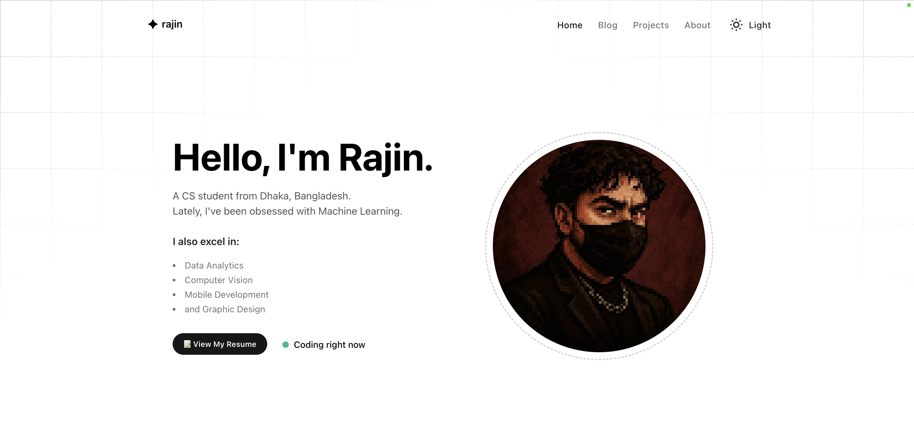
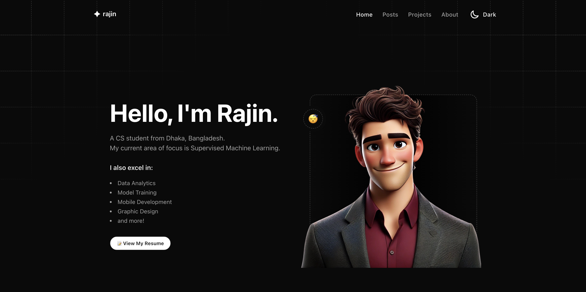
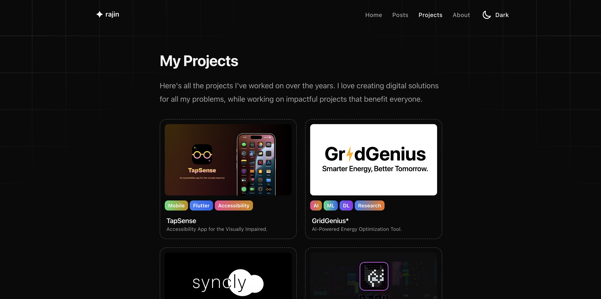
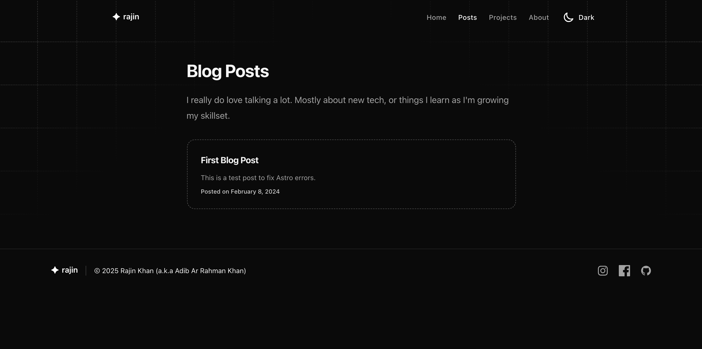

# **🧑🏻‍💻 Rajin Khan - Portfolio Website**  

---

### **🚀 Tech & Deployment**

  
  
  

### **📜 License & Status**

  
  

---

A sleek, **blazing-fast** portfolio built with **Astro** and **TailwindCSS**, designed to showcase projects, blog posts, and my resume – all in one place. 
*(Also, my website will force you to use dark mode for every instance that you reload it. Because that is the only way it should be viewed. Cheers!)*

### **🌍 Live Now →** [rajinkhan.vercel.app](https://rajinkhan.vercel.app)

---

## **📸 Screenshots**
### 🌞 Light & 🌙 Dark Mode  
| Light Mode  | Dark Mode  |
|---|---|
|  |  |

### **🛠️ Projects Section**  

### **📝 Blog Section**  

---

## **✨Features:**
Different theme modes  
Smooth animations and abstract designs  
Project showcase with tags  
Markdown-powered blog  
Fully responsive on **all devices**  

---

## **⚡ Tech Stack**
🛠 **Framework:** Astro  
🎨 **Styling:** TailwindCSS  
🚀 **Hosting:** Vercel  

---

## **📬 Contact Me**
📧 **Email:** [rajin.khan2001@gmail.com](mailto:rajin.khan2001@gmail.com)  
🔗 **LinkedIn:** [linkedin.com/in/rajin-khan](https://linkedin.com/in/rajin-khan)  
📸 **Instagram:** [@raaajiin](https://twitter.com/raaajiin)  

---

### **⏭️ Future Improvements**
🔹 Improve accessibility  
🔹 Performance optimization  
🔹 Expand blog content  

