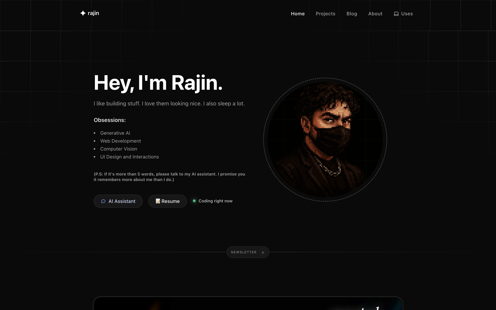
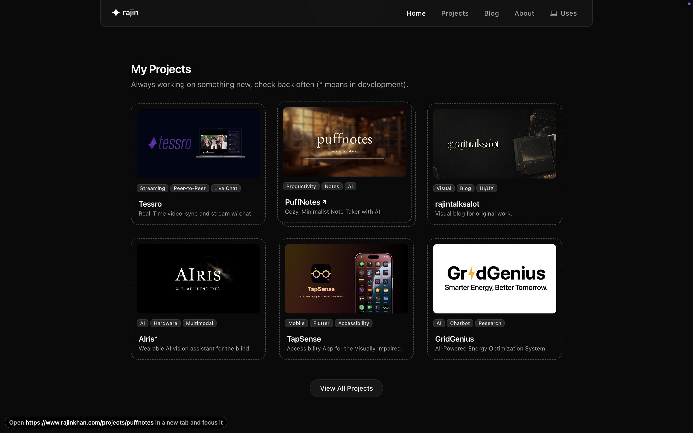
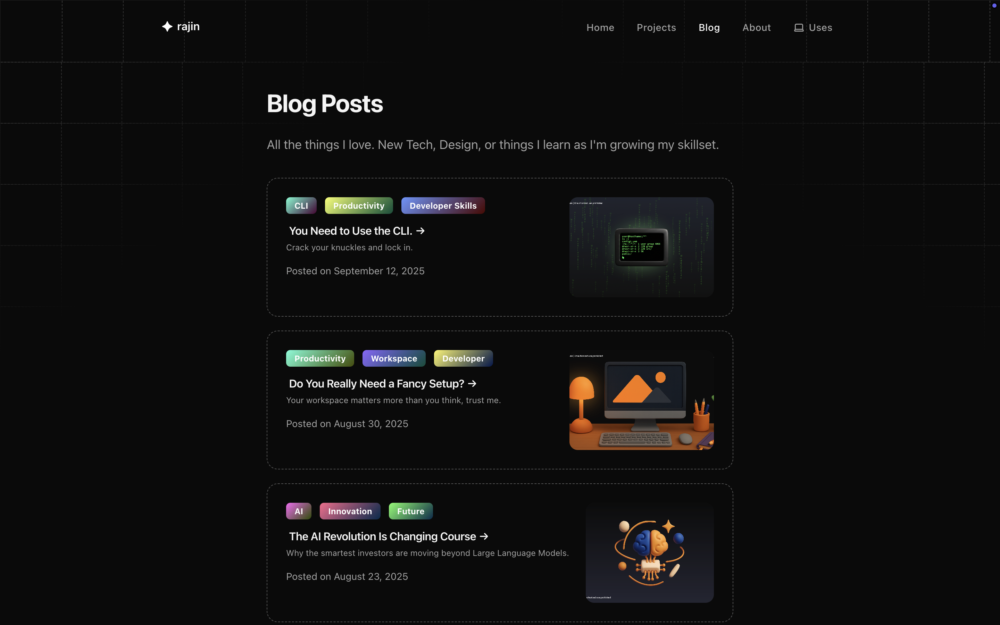
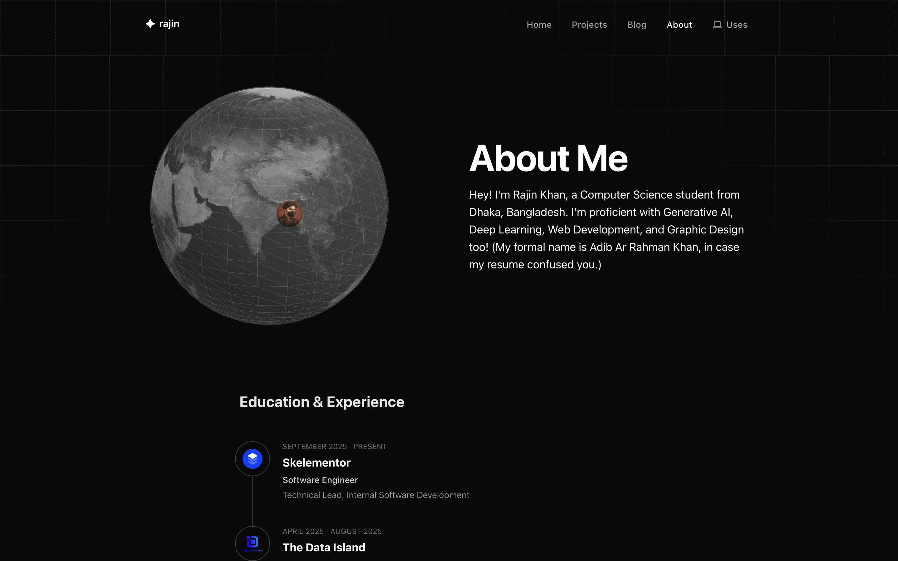
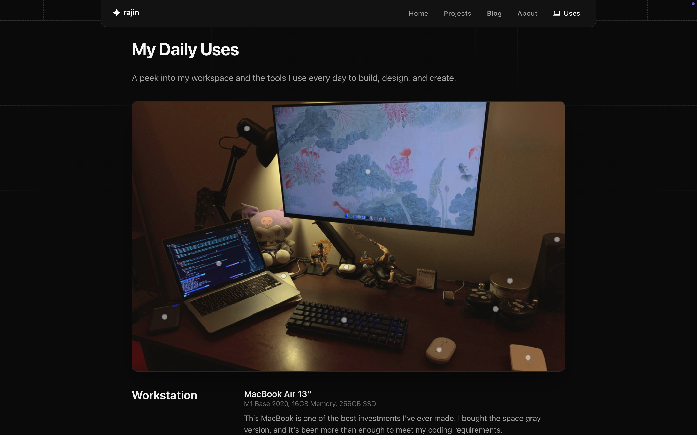
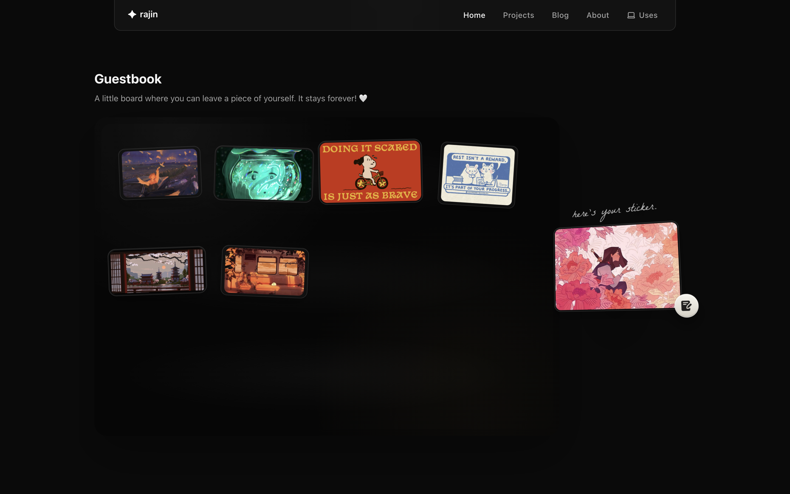

# Rajin Khan - Portfolio

My corner of the internet for things I build, write, use, and occasionally over-engineer because the interaction felt wrong.

[Visit the site](https://rajinkhan.com) · [Projects](https://rajinkhan.com/projects) · [Blog](https://rajinkhan.com/posts) · [About](https://rajinkhan.com/about) · [Uses](https://rajinkhan.com/uses)

## A portfolio, technically

Most portfolios stop after projects and a contact link. This one got slightly out of hand.

It is part portfolio, part lab notebook, and part guestbook. There are project case studies, two different homes for my writing, a live look at what I am coding, a small trip around the world, an interactive map of the things on my desk, and a sticker board where visitors can leave a tiny piece of themselves behind.

## The bits I like

- **The sticker guestbook.** Pick a sticker, write a short note, optionally sign it, and place it on the board. Entries keep their names, dates, doodles, and positions in Upstash Redis. There is also one little heartbeat sticker that changes every day through a Vercel cron job, because apparently the site needed a pulse.
- **Projects that feel like projects.** Each one has its own imagery, neutral tags, summary, and case-study page instead of being reduced to a logo and one sentence.
- **Two writing worlds.** The blog gives every technical post its own little editorial image; visual and creative work opens into [RAJINTALKSALOT](https://rajintalksalot.vercel.app/).
- **A Three.js hello from Dhaka.** The About page opens on a monochrome globe, turns toward Bangladesh, pins me to Dhaka, and then makes room for the actual introduction.
- **The desk is the menu.** Uses turns a real photograph of my setup into an annotated map. The pulsing points are the things I actually use, not decorative dots pretending to be useful.
- **Curated.** A small newsletter built into the homepage, backed by Redis for subscribers and Resend for delivery.
- **Live activity.** The homepage fetches my latest public GitHub commit, so the site gives away what I am tinkering with before I remember to update this README.
- **Small-screen friendly.** The layouts, project grid, writing section, and sticker board all recompose for mobile rather than merely shrinking until they surrender.

## Projects

The homepage keeps the catalogue compact; the full project pages carry the details.

## Blog

The blog has its own page and visual rhythm. Every post gets a compact illustration, tags, date, and just enough of a description to tell you whether it is worth opening.

## About

About does not begin with a biography. It begins in orbit.

The intro is a custom Three.js scene: a textured monochrome Earth rotates toward Dhaka, a small photo pin appears over the city, and the camera makes room for the copy. It turns "I am from Dhaka" into something you see before you read it, which is much more fun than another portrait beside a paragraph.

## Uses

The setup photograph doubles as the interface. Hover or tap one of the glowing points and the corresponding piece of gear introduces itself; keep scrolling and the full workstation, accessories, figures, applications, and subscriptions are all there.

## Guestbook

The sticker board is the most needlessly elaborate part of the site. Naturally, it is also my favourite.

## Built with

| Layer | What it does |
| --- | --- |
| [Astro 5](https://astro.build/) | Static-first pages, content, routing, and server endpoints |
| [React 19](https://react.dev/) | Interactive islands for the globe and sticker board |
| [Tailwind CSS](https://tailwindcss.com/) | Layout and styling alongside component-scoped CSS |
| [Three.js](https://threejs.org/) | The textured globe, Dhaka pin, camera movement, and About intro |
| [Upstash Redis](https://upstash.com/) | Sticker placements and newsletter subscribers |
| [Resend](https://resend.com/) | Newsletter delivery |
| [Vercel](https://vercel.com/) | Hosting, serverless API routes, and A.R.I.A.'s daily guestbook note |

Astro handles the quiet parts; React only wakes up for the pieces that genuinely need to move.

## License

Licensed under the [Apache License 2.0](./LICENSE).

Built by [Rajin Khan](https://github.com/rajin-khan), usually from Dhaka and usually with too many tabs open.
